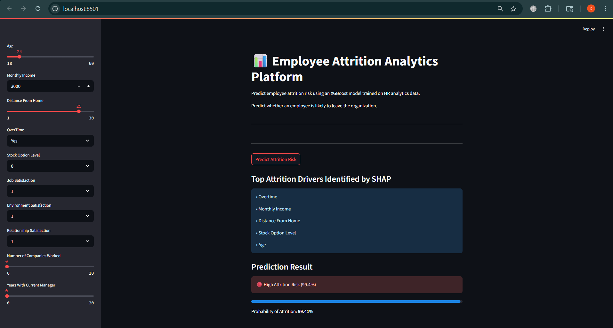
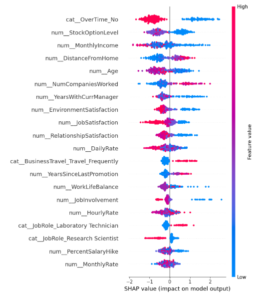
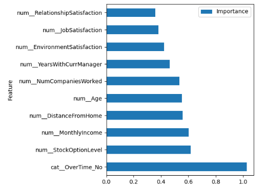
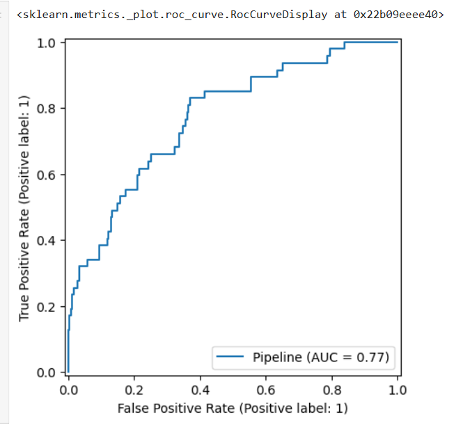

# 📊 Employee Attrition Analytics Platform

An end-to-end Machine Learning project that predicts employee attrition risk using XGBoost, Scikit-Learn Pipelines, and SHAP Explainability.

The project helps identify employees at risk of leaving the organization and provides insights into the key factors influencing attrition.

---

## 🚀 Live Demo

Coming Soon

---

## 📌 Project Overview

Employee attrition is a critical challenge for organizations. High turnover increases recruitment costs, affects productivity, and impacts team stability.

This project uses Machine Learning to:

- Predict whether an employee is likely to leave the organization.
- Analyze the most influential factors driving attrition.
- Provide an interactive Streamlit interface for real-time risk assessment.

---

## 🛠 Tech Stack

- Python
- Pandas
- NumPy
- Scikit-Learn
- XGBoost
- SHAP
- Streamlit
- Git & GitHub

---

## ⚙️ Machine Learning Pipeline

```text
Raw Data
   ↓
Data Cleaning
   ↓
EDA
   ↓
Feature Selection
   ↓
ColumnTransformer
   ↓
Pipeline
   ↓
XGBoost Classifier
   ↓
SHAP Explainability
   ↓
Streamlit Deployment
```

---

## 📈 Model Performance

| Metric | Score |
|----------|----------|
| Accuracy | 82.7% |
| ROC-AUC | 0.77 |
| Precision (Attrition) | 0.44 |
| Recall (Attrition) | 0.32 |
| F1 Score (Attrition) | 0.37 |

---

## 🔍 SHAP Explainability

To improve model interpretability, SHAP (SHapley Additive exPlanations) was used to identify the factors contributing most to employee attrition predictions.

### Top Attrition Drivers

1. Overtime
2. Stock Option Level
3. Monthly Income
4. Distance From Home
5. Age
6. Number of Companies Worked
7. Years With Current Manager
8. Environment Satisfaction
9. Job Satisfaction
10. Relationship Satisfaction

---

## 📊 Visualizations

### Streamlit Application



---

### SHAP Summary Plot



---

### SHAP Feature Importance



---

### ROC Curve



---

## 💡 Key Business Insights

- Employees working overtime showed the highest attrition risk.
- Lower monthly income was associated with increased turnover probability.
- Longer commuting distances contributed to employee attrition.
- Younger employees were more likely to leave the organization.
- Higher job and environment satisfaction significantly improved retention.

---

## 📁 Project Structure

```text
employee-attrition-analytics-platform/

├── models/
│   └── attrition_streamlit.pkl

├── screenshots/
│   ├── app.png
│   ├── shap_beeswarm.png
│   ├── shap_importance.png
│   └── roc_curve.png

├── app.py
├── requirements.txt
├── README.md
└── .gitignore
```

---

## 🎯 Future Improvements

- Real-time HR Dashboard
- Employee Retention Recommendation System
- Department-wise Attrition Analytics
- Cloud Deployment
- Automated Reporting

---

## 👨‍💻 Author

Kushagra Tyagi

B.Tech CSE | Machine Learning & Data Science Enthusiast
